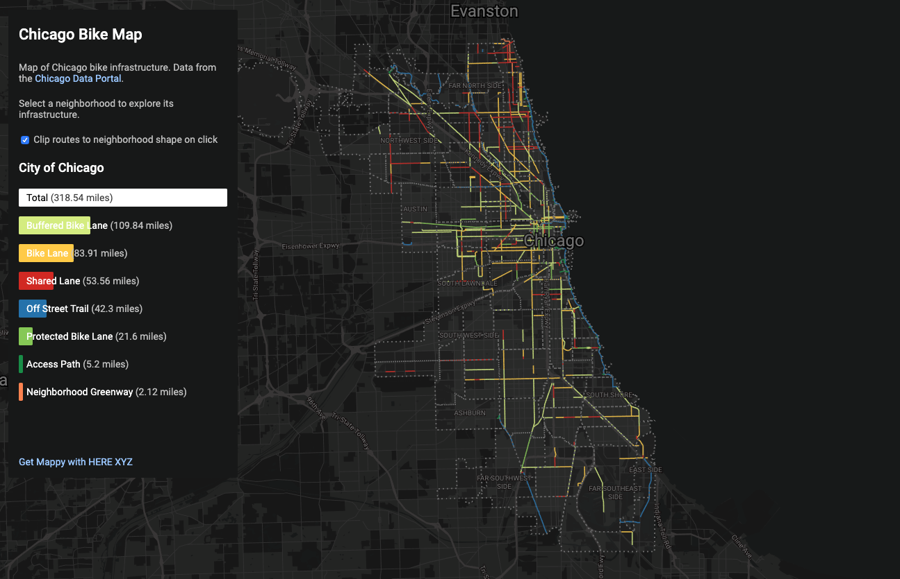

# Chicago Bike Map


This is an interactive map of the Chicago bike route dataset from the [Chicago Data Portal](https://data.cityofchicago.org/Transportation/Bike-Routes/3w5d-sru8).

This map was made with [XYZ Hub API](https://www.here.xyz/api/), [Leaflet](https://leafletjs.com/), and [Tangram](https://github.com/tangrams/tangram).

## Live Demo

You can view a live demo of the map at: [dbabbs.github.io/chicago-bike-map](https://dbabbs.github.io/chicago-bike-map)

## Running locally

```
git clone https://github.com/dbabbs/chicago-bike-map.git
cd chicago-bike-map
python -m SimpleHTTPServer 8888
```
